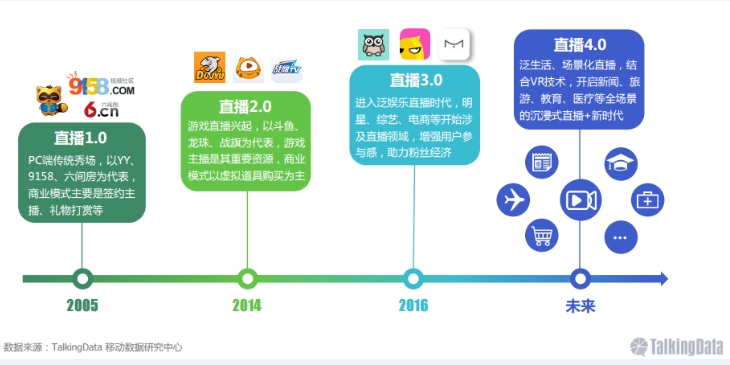
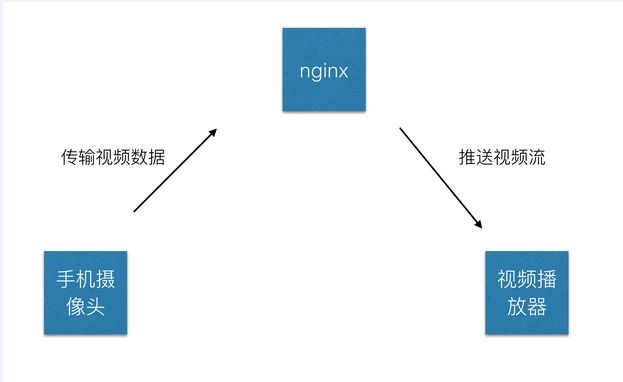

# HTML5 broadcast

>  HTML5直播相关技术文档和方案。本系列所有内容全部来自互联网，包括但不限于互联网文章，技术博客，协议文档和个人翻译等。

### 视频直播的发展

​	可以看到，直播从 PC 到一直发展到移动端，越来越多的直播类 App 上线，同时移动直播进入了前所未有的爆发阶段，但是对于大多数移动直播来说，还是要以 Native 客户端实现为主，但是 HTML5 在移动直播端也承载着不可替代的作用，例如 HTML5 有着**传播快，易发布**的优势，同时最为关键的时 HTML5 同样可以播放直播视频。

HTML5对于音频视频以及2D、3D图像的支持越来越完善，比如这些标签：

- `<canvas>`提供了脚本渲染图形，游戏图形等功能。这也叫做`Canvas JavaScript API`。cancas元素也可以与WebGL结合通过显卡的GPU，来渲染2D和3D图形。

- `<video>`实现了即开即用的视屏播放，很牛叉是吧。这也让在Web上实现无插件媒体播放变得可行。实际上，各家浏览器厂商好像都同意用使用一种视频格式MPEG-4/H.264，这在所有浏览器中已经普遍支持了。不过Opera Mini是一个例外。

- `<audio>`实现了在Web网页上即开即用的音频播放。与视频播放一样，支持什么样的格式和编码要看不同的浏览器厂商。
- `<track>`用于定时文本内容显示，例如视频中的字幕和提示。WebVTT文件是开箱即用的。

不断完善的相关协议和浏览器的支持也让HTML5视频直播变得越来越成熟。

### HTML5 直播的流程

完整的直播可以分为以下几块：

* **视频录制端**：一般是电脑上的音视频输入设备或者手机端的摄像头或者麦克风，目前以移动端的手机视频为主。

* **视频播放端**：可以是电脑上的播放器，手机端的 Native 播放器，还有就是 HTML5 的 `video` 标签等，目前还是已手机端的 Native 播放器为主。

* **视频服务器端**：一般是一台 nginx 服务器，用来接受视频录制端提供的视频源，同时提供给视频播放端流服务。

  

[视频播放相关技术介绍](./Introduction.md)

